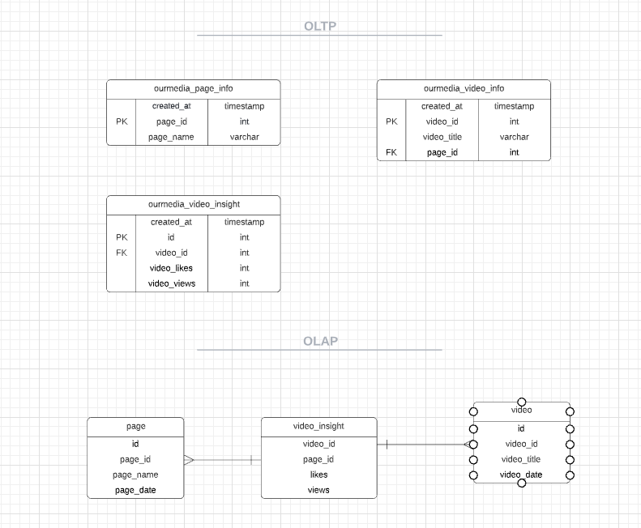

# my_brut_project

### _**INSTALLATION**_
To use this project clone the repo using the command below:

`git init`

`git clone https://github.com/lolotteisyoung/my_brut_project.git`

Create env file (ask developer for the env variable)

### _**USAGE**_

To run the API on http://localhost:8000/
launch the following code in api.py :

`create_tables()`

`app.run(port=8000, debug=False)`

######Launch main.py to do the following actions

the variable page, video_a, video_b, video_insight_a, video_insight_b contain all the informations needed to create a page, a video and the insight of a video.
We are using the module requests to do our api call

###**_1. create page with name OurMedia France_**
the api call _post_ will send the data of the page "OurMediaFrance" to the database

###**_2. create a video A and a video B of page Brut France_**
the api call _post_ will send the data of the video A and video B to the database

###**_3. create insight for video A and insight for video B_**
the api call _post_ will send the data of the insight for video A and for video B to the database

###**_4. delete video B_**
the api call _delete_ will delete the data of the video B

###_5.an analytics database_ 

 